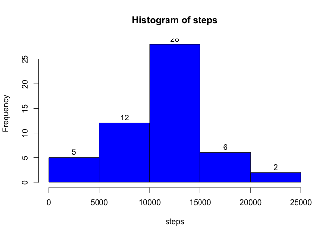
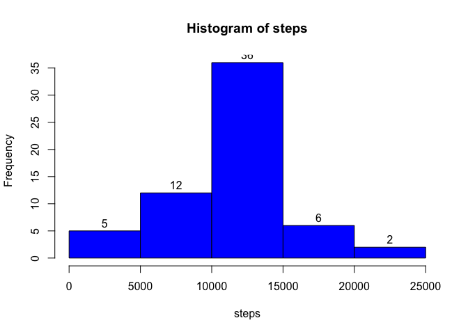
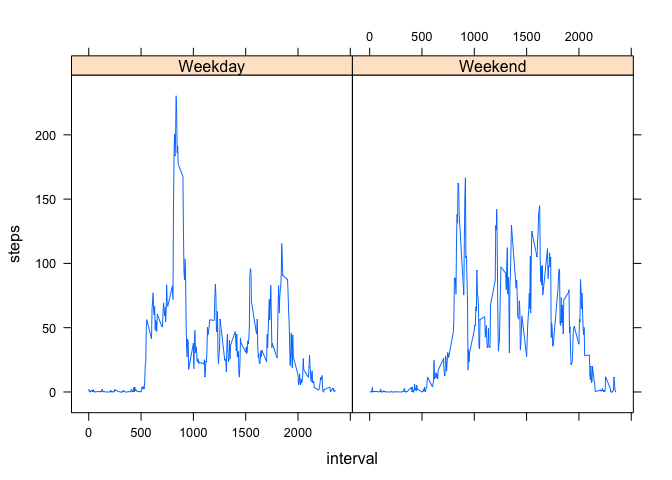

# Reproducible Research: Peer Assessment 1


## Loading and preprocessing the data

```r
setwd("~/GitHub/RepData_PeerAssessment1")
activity = read.csv(unz("activity.zip", "activity.csv"))
stepsDate = aggregate(steps ~ date, data = activity, sum, na.rm = TRUE)
steps=stepsDate$steps
```

## What is mean total number of steps taken per day?

```r
meanSteps=mean(stepsDate$steps, na.rm = TRUE)
meanSteps
```

```
## [1] 10766.19
```

```r
medianSteps=median(steps, na.rm = TRUE)
medianSteps
```

```
## [1] 10765
```

```r
hist(steps, col = "blue", labels = TRUE)
```

 

## What is the average daily activity pattern?

```r
stepsInterval = aggregate(steps ~ interval, data = activity, mean, na.rm = TRUE)
plot(steps ~ interval, data = stepsInterval, type = "l")
```

 

## Which 5-minute interval, on average across all the days in the dataset, contains the maximum number of steps?

```r
max=max(stepsInterval$steps)
max
```

```
## [1] 206.1698
```

```r
for (i in 1:nrow(stepsInterval))
    if(stepsInterval$steps[i]==max)
        maxInterval =stepsInterval$interval[i]
maxInterval
```

```
## [1] 835
```

## Imputing missing values

```r
newActivity = read.csv(unz("activity.zip", "activity.csv"))
head(newActivity)
```

```
##   steps       date interval
## 1    NA 2012-10-01        0
## 2    NA 2012-10-01        5
## 3    NA 2012-10-01       10
## 4    NA 2012-10-01       15
## 5    NA 2012-10-01       20
## 6    NA 2012-10-01       25
```

```r
stepsInterval = aggregate(steps ~ interval, data = newActivity, mean)
s=sum(is.na(newActivity$steps))
s
```

```
## [1] 2304
```

```r
for (j in 1:nrow(newActivity))
    if(is.na(newActivity$steps[j]))
        {
        for (i in 1:nrow(stepsInterval))
            if(stepsInterval$interval[i]==newActivity$interval[j])
                newActivity$steps[j] =stepsInterval$steps[i]
        }
        
head(newActivity)
```

```
##       steps       date interval
## 1 1.7169811 2012-10-01        0
## 2 0.3396226 2012-10-01        5
## 3 0.1320755 2012-10-01       10
## 4 0.1509434 2012-10-01       15
## 5 0.0754717 2012-10-01       20
## 6 2.0943396 2012-10-01       25
```

```r
stepsDate = aggregate(steps ~ date, data = newActivity, sum)
steps=stepsDate$steps
newMeanSteps=mean(steps)
newMeanSteps
```

```
## [1] 10766.19
```

```r
meanSteps-newMeanSteps
```

```
## [1] 0
```

```r
newMedianSteps=median(steps)
newMedianSteps
```

```
## [1] 10766.19
```

```r
medianSteps-newMedianSteps
```

```
## [1] -1.188679
```

```r
hist(steps, col = "blue", labels = TRUE)
```

 


## Are there differences in activity patterns between weekdays and weekends?

```r
library(lubridate)
newActivity$day="Weekday"
newActivity$day[wday(newActivity$date)%%6==1]="Weekend"

stepsWeek = aggregate(steps ~ interval + day, newActivity, mean)

library(lattice)
xyplot(steps ~ interval | day, data = stepsWeek,type = "l")
```

 

